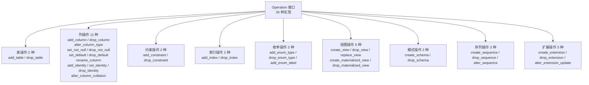

# MIGRA-Go API 参考文档

> 最后更新：2026-06-15

本文档是 MIGRA-Go 内部包的 API 参考文档。

## 包结构

### 核心包

| 包名 | 说明 | 主要功能 |
|------|------|----------|
| `internal/model` | 数据模型 | Schema、Table、Column、View、Sequence、Extension 等核心数据结构 |
| `internal/diff` | 差异比较引擎 | 比较两个 Schema 的差异，生成 34 种 Operation |
| `internal/plan` | 执行计划 | 三阶段执行计划（Pre-deploy/Deploy/Post-deploy），DAG 拓扑排序 |
| `internal/render` | SQL/JSON 渲染器 | 多态分发渲染，render.go + render_helpers.go + render_json.go |

### 解析器包

| 包名 | 说明 | 主要功能 |
|------|------|----------|
| `internal/parser` | SQL 解析器 | 基于 pg_query_go 解析 AST，通过 Handler 模式转换 DDL |
| `internal/parser/parserutil` | 解析器工具 | 类型映射、表达式解析、列解析等辅助函数 |

### 数据源包

| 包名 | 说明 | 主要功能 |
|------|------|----------|
| `internal/source` | 数据源加载 | 统一加载接口，支持 SQL 文件、目录、数据库三种来源 |
| `internal/introspect` | 数据库内省 | 从 PostgreSQL 实例读取 Schema 结构 |

### 工具包

| 包名 | 说明 | 主要功能 |
|------|------|----------|
| `internal/normalize` | 语义归一化 | 同义类型映射（如 int4 → integer），减少误报 |
| `internal/errors` | 错误定义 | 结构化错误（带 Code/Message/Cause）+ 哨兵错误，统一错误处理 |
| `internal/util` | 工具函数 | 通用工具函数（QuoteIdentifier、NormalizeDataType 等） |
| `internal/indexdef` | 索引定义解析 | 解析 pg_get_indexdef 输出的索引定义字符串 |
| `internal/version` | 版本信息 | 版本号、构建时间等元信息（-ldflags 注入） |

### 应用层包

| 包名 | 说明 | 主要功能 |
|------|------|----------|
| `internal/app` | 应用服务 | 依赖注入编排，DiffService 接口，流水线编排（pipeline.go） |
| `internal/testutil` | 测试工具 | Golden 文件测试、JSON schema 比较等辅助函数 |

## 核心类型

### model.Schema

```go
type Schema struct {
    Schemas    map[string]*Namespace
}
```

表示完整的数据库 Schema 结构，包含多个命名空间。

### diff.Operation

```go
type Operation interface {
    Kind() Kind
    ObjectKey() model.ObjectKey
    DependsOn() []model.ObjectKey
    IsDestructive() bool
    RenderString(ctx RenderContext) string
}
```

差异操作接口，所有 34 种操作类型都实现此接口。每个 Operation 自己实现 `RenderString` 方法，渲染器通过多态分发调用。

### plan.Engine

```go
type Engine interface {
    Plan(ops []Operation) map[Stage][]Operation
}
```

执行计划引擎接口，将 Operation 分组为三个阶段。

### render.SQLEngine

```go
type SQLEngine interface {
    RenderAll(ctx context.Context, ops []diff.Operation) (string, error)
}
```

SQL 渲染引擎接口，将所有 Operation 渲染为完整 SQL 输出。

渲染器采用**多态分发**模式：每个 Operation 类型实现 `RenderString(ctx RenderContext) string` 方法，Renderer 通过接口调用而非巨型 switch 来渲染。渲染逻辑拆分在以下文件中：

| 文件 | 说明 |
|------|------|
| `render.go` | SQLEngine 接口 + RenderAll 编排（73 行） |
| `render_helpers.go` | 各 Operation 的渲染辅助函数（131 行） |
| `render_json.go` | JSON 格式渲染（36 行） |

### render.Renderer

```go
func NewRenderer() *Renderer
func (r *Renderer) RenderOutput(ctx context.Context, ops []diff.Operation, format string) (string, error)
func (r *Renderer) RenderAll(ctx context.Context, ops []diff.Operation) (string, error)
func (r *Renderer) Render(op diff.Operation) string
```

渲染器，将 Operation 渲染为 SQL 或 JSON。`Render` 方法通过 `op.RenderString(r)` 多态分发。

## 主要函数

### diff.Differ

```go
func NewDiffer() *Differ
func (d *Differ) Diff(ctx context.Context, source, target *model.Schema) ([]Operation, []string)
```

差异比较器，比较两个 Schema 并返回 Operation 列表。

### plan.Planner

```go
func NewPlanner(unsafeDrop bool) *Planner
func (p *Planner) Plan(ctx context.Context, ops []diff.Operation) (map[Stage][]diff.Operation, error)
```

执行计划器，将 Operation 分组为三个阶段。

### plan.TopoSort

```go
func TopoSort(ctx context.Context, ops []diff.Operation) ([]diff.Operation, error)
```

基于 Kahn 算法的拓扑排序，保证依赖关系正确。

### source.Loader

```go
type Loader interface {
    Match(source string) bool
    Load(ctx context.Context, source string, opt LoadOptions) (*model.Schema, []error, error)
    Priority() LoaderPriority
}
```

数据源加载器接口，支持 SQL 文件、目录、数据库三种来源。

### normalize.CanonicalizeSchema

```go
func CanonicalizeSchema(schema *model.Schema) error
```

语义归一化，将同义类型映射为标准形式。

## 错误类型

### errors 包

errors 包提供**双重错误体系**：

**1. 结构化错误（新代码路径使用）：**

```go
type Error struct {
    Code    string   // 错误码，如 "NOT_FOUND", "PARSE_FAILED"
    Message string   // 人类可读描述
    Cause   error    // 底层原因（支持 wrapping）
}

// 支持 Unwrap，兼容 errors.Is / errors.As
func (e *Error) Unwrap() error
```

结构化错误码：

```go
var (
    ErrCodeNotFound    = &Error{Code: "NOT_FOUND", Message: "resource not found"}
    ErrCodeParseFailed = &Error{Code: "PARSE_FAILED", Message: "parse failed"}
    ErrCodeLoadFailed  = &Error{Code: "LOAD_FAILED", Message: "load failed"}
    ErrCodeDiffFailed  = &Error{Code: "DIFF_FAILED", Message: "diff failed"}
)
```

**2. 哨兵错误（向后兼容）：**

```go
var (
    ErrNotFound      = errors.New("resource not found")
    ErrInvalidConfig = errors.New("invalid configuration")
    ErrParseFailed   = errors.New("parse failed")
    ErrLoadFailed    = errors.New("load failed")
    ErrDiffFailed    = errors.New("diff failed")
)
```

## 配置项

### app.Config

```go
type DiffConfig struct {
    Source     string
    Target     string
    Schemas    []string
    Format     string
    OutputFile string    // 输出文件路径（空则输出到 stdout）
    UnsafeDrop bool
    Strict     bool
    Timeout    time.Duration
}
```

应用配置结构体，包含所有配置项。

## Operation 类型完整列表（34 种）



## 使用示例

### 基本差异比较

```go
package main

import (
    "github.com/fred29910/migra-go/internal/diff"
    "github.com/fred29910/migra-go/internal/model"
)

func main() {
    source := &model.Schema{}
    target := &model.Schema{}

    differ := diff.NewDiffer()
    operations, warnings := differ.Diff(context.Background(), source, target)

    for _, op := range operations {
        fmt.Printf("Operation: %s\n", op.Kind())
    }
}
```

### 渲染 SQL

```go
package main

import (
    "github.com/fred29910/migra-go/internal/render"
)

func main() {
    var operations []diff.Operation

    renderer := render.NewRenderer()
    sql, err := renderer.RenderOutput(operations, "sql")
    if err != nil {
        log.Fatal(err)
    }

    fmt.Println(sql)
}
```

## 相关文档

- [README.md](../README.md) - 项目概述和完整功能列表
- [arch.md](./arch.md) - 架构设计文档
- [DDL.md](./DDL.md) - 支持的 DDL 类型矩阵
