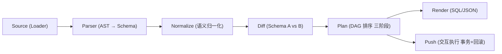
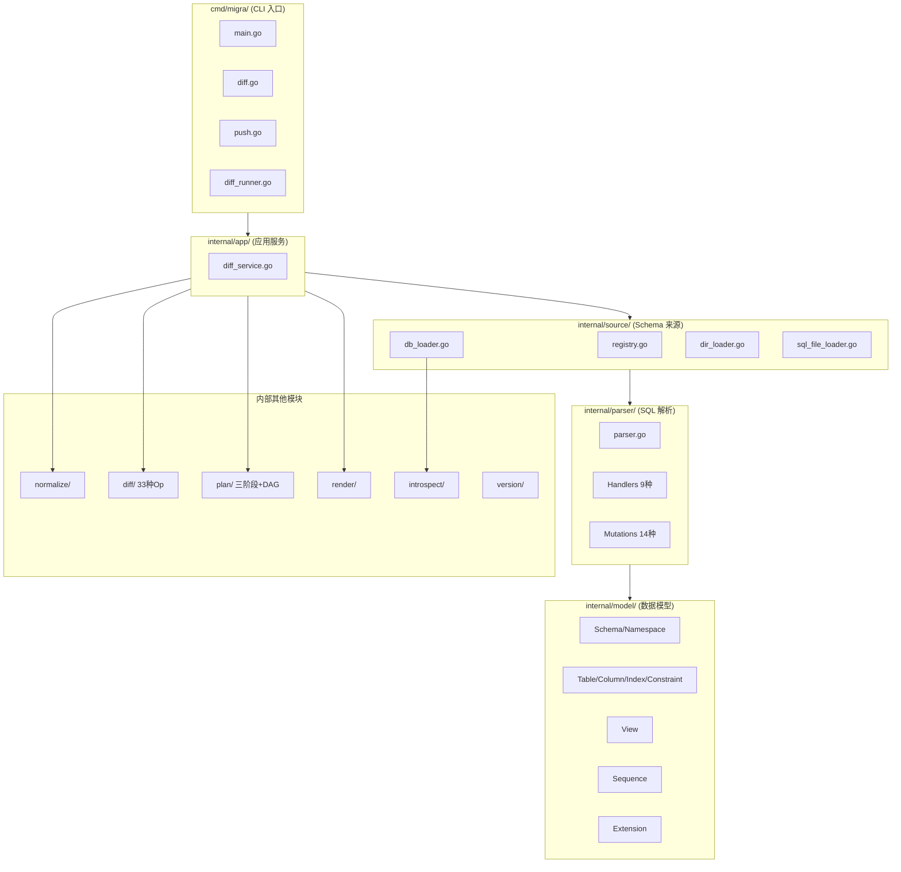
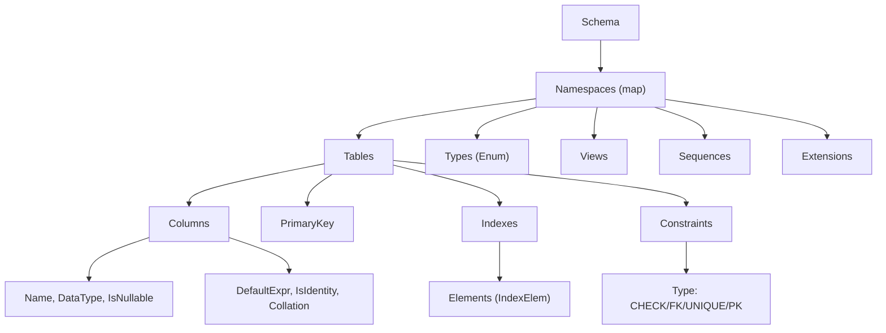
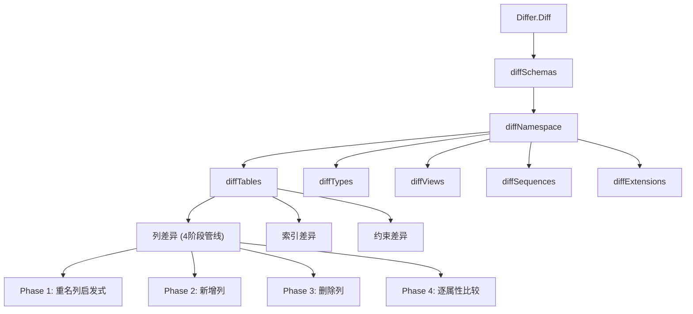
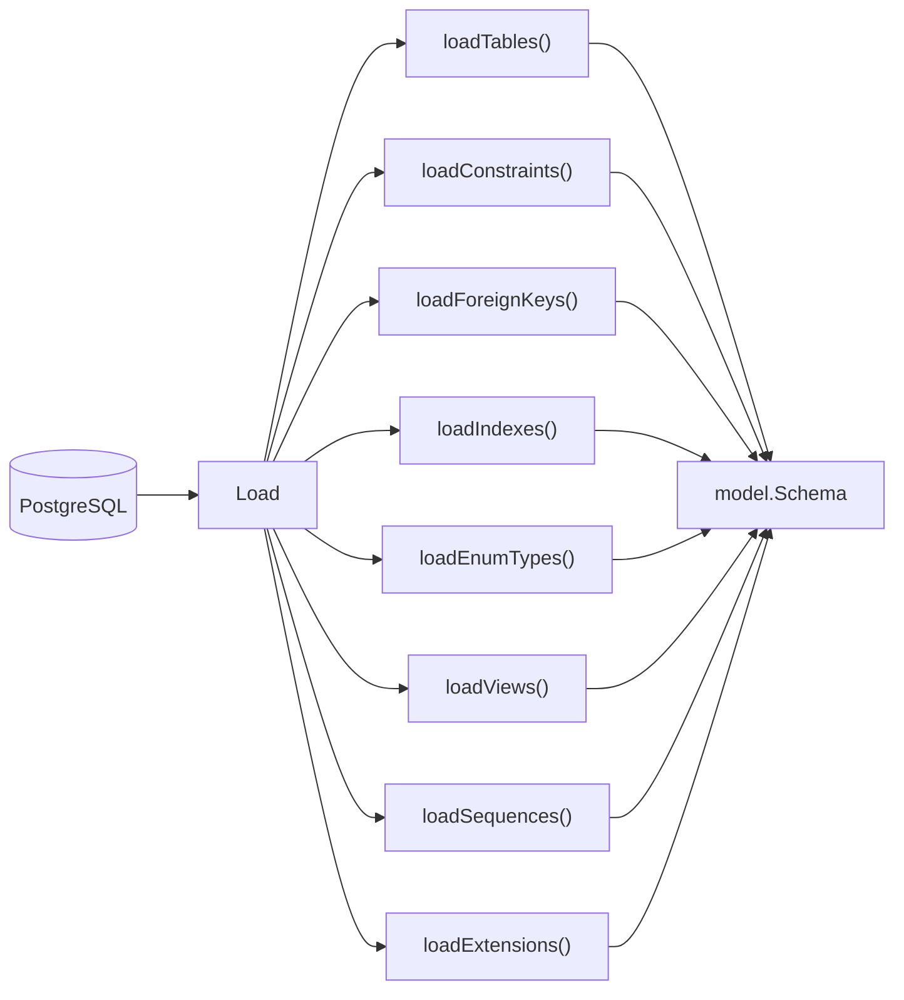
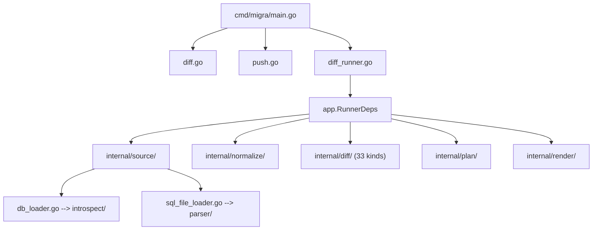

# MIGRA-Go 架构文档

> 最后更新：2026-06-03

## 概述

MIGRA-Go 是一个用 Go 编写的 PostgreSQL Schema 差异比较工具。它采用**五阶段流水线架构**，将 schema 加载、解析、归一化、差异比较、执行计划编排和渲染输出串联为一条清晰的数据处理管道。

核心设计原则：

- **接口驱动**：每个核心阶段都定义了 Go 接口，支持多种实现策略
- **OCP（开闭原则）**：新增 DDL 类型只需实现 Handler + Mutation 并注册，无需改动核心解析器
- **依赖注入**：通过 `RunnerDeps` 将核心依赖注入到应用服务层，便于测试
- **策略模式**：Source 加载层通过 Registry 自动匹配来源类型

---

## 1. 五阶段流水线



### 阶段职责

| # | 阶段 | 包 | 输入 | 输出 |
|---|------|-----|------|------|
| 1 | Source | `internal/source/` | 路径/URL 字符串 | `*model.Schema` |
| 2 | Parser | `internal/parser/` | SQL 文本 | `*model.Schema` |
| 3 | Normalize | `internal/normalize/` | `*model.Schema` | 归一化的 `*model.Schema` |
| 4 | Diff | `internal/diff/` | `source, target *model.Schema` | `[]Operation` (33 种) |
| 5 | Plan + Render | `internal/plan/` + `internal/render/` | `[]Operation` | SQL / JSON |

---

## 2. 分层架构



### 2.1 CLI 层 (`cmd/migra/`)

基于 **Cobra** + **Viper**，支持多级配置：命令行参数 > 环境变量 > 配置文件。

```
cmd/migra/
├── main.go               # 根命令、全局配置初始化、version 标志
├── diff.go               # diff 子命令定义 + sourceRegistry 注册
├── diff_runner.go        # diff 参数解析 + 依赖注入工厂 (newDefaultDeps)
├── diff_test.go          # CLI 层测试
├── diff_runner_test.go   # diff 运行器测试
├── push.go               # push 子命令定义
├── push_runner.go        # push 交互执行逻辑（事务、确认、回滚、校验）
├── push_test.go          # push 命令测试
├── version_test.go       # version 输出测试
└── integration_test.go   # 端到端集成测试
```

**关键组件：**

- **sourceRegistry** (`diff.go:16-22`)：全局 Loader 注册表，注册顺序决定匹配优先级：`DBLoader → DirectoryLoader → SQLFileLoader`
- **依赖注入** (`diff_runner.go:86-98`)：`newDefaultDeps()` 返回 `app.RunnerDeps`，包含 `LoadSchema`、`Compute`、`Render` 三个函数
- **diff 参数模式**：支持 0/1/2 个参数
- **push 交互流程**：Load schema → ComputeDiff → Diff Preview → 逐条确认(y/n/a/s) → 事务提交 → 执行后校验
- **版本信息**：`--version` / `-v` 通过 `internal/version` 包读取构建时注入的信息

### 2.2 应用服务层 (`internal/app/`)

`diff_service.go` 是整个流水线的编排者。

```go
type DiffService interface {
    Run(ctx context.Context, cfg Config) (output string, warnings []string, err error)
}
```

`ComputeDiff` (行 176-197) 是核心管线：

```
FilterNamespaces → NormalizeSchemas → Differ.Diff → FilterDestructiveOps → BuildExecutionPlan
```

### 2.3 Source 层 (`internal/source/`)

采用 **Registry 策略模式**，通过 `Loader` 接口统一多种来源。

| Loader | Match 条件 | Load 行为 |
|--------|-----------|-----------|
| `DBLoader` | `postgres://`, `postgresql://`, `pg://` 前缀 | 连接数据库 → `introspect.LoadFromDBWithConn` |
| `DirectoryLoader` | `os.Stat(path).IsDir()` 为 true | 递归扫描 → 合并 SQL → 一次性解析 |
| `SQLFileLoader` | `.sql` 后缀 或 `file://` 前缀 | `os.ReadFile` → `parser.ParseSQL` |

**DirectoryLoader 合并策略**：递归遍历 → 跳过隐藏文件 → 路径排序 → 合并 SQL → 一次性解析（确保跨文件 DDL 依赖正确解析）

### 2.4 模型层 (`internal/model/`)

数据模型采用**树状组合结构**：



**关键类型：**

- **ObjectKey** (`object_key.go`)：统一的对象标识符，包含 `Schema`、`Name`、`Kind`(Table/Column/Index/Constraint/Type/View/Sequence/Extension/Schema)
- **FKActionCode** (`fk_action.go`)：单字符 FK 动作码到 SQL 关键字的映射

### 2.5 解析器层 (`internal/parser/`)

基于 **pg_query_go**，采用 **Handler Registry + 访问者模式**实现 OCP。

**已有的 Handler（9 种）：**

| Handler | DDL 语句 | 产生的 Mutation |
|---------|----------|----------------|
| `CreateTableHandler` | `CREATE TABLE` | `CreateTableMutation` |
| `AlterTableHandler` | `ALTER TABLE ...` | `AddColumnMutation`, `DropColumnMutation`, `AlterColumnTypeMutation`, `SetNotNullMutation`, `DropNotNullMutation`, `SetDefaultMutation`, `DropDefaultMutation`, `AddConstraintMutation`, `DropConstraintMutation` |
| `CreateIndexHandler` | `CREATE INDEX` | `CreateIndexMutation` |
| `CreateEnumHandler` | `CREATE TYPE ... AS ENUM` | `CreateEnumTypeMutation` |
| `CreateSchemaHandler` | `CREATE SCHEMA` | `CreateSchemaMutation` |
| `RenameStmtHandler` | `ALTER TABLE ... RENAME COLUMN` | `RenameColumnMutation` |
| `CreateViewHandler` | `CREATE VIEW` | `CreateViewMutation` |
| `CreateSequenceHandler` | `CREATE SEQUENCE` | `CreateSequenceMutation` |
| `CreateExtensionHandler` | `CREATE EXTENSION` | `CreateExtensionMutation` |

**所有 Mutation 类型（14 种）：**

`create_table`, `add_column`, `create_enum_type`, `create_index`, `drop_column`, `alter_column_type`, `set_not_null`, `drop_not_null`, `set_default`, `drop_default`, `create_schema`, `rename_column`, `add_constraint`, `drop_constraint`

> **注意**：视图（View）、序列（Sequence）和扩展（Extension）作为顶级对象（非表的子属性），其 Mutation 直接通过 Handler 应用到 Schema 层，不经过 AlterTable 路径。

### 2.6 语义归一化 (`internal/normalize/`)

归一化是**原地修改** schema 对象，减少同义表达导致的误报。

| 规则 | 示例 |
|------|------|
| 类型别名映射 | `int4` → `integer`, `bool` → `boolean` |
| 标识符规范化 | 去除引号，小写化 |
| 默认值表达式规范化 | 剥离括号/类型转换 |
| 约束定义规范化 | 小写化 + 合并空白 |
| Index Elem 填充 | `Columns` → `Elements` 转换 |
| 视图定义规范化 | 去除末尾分号、trim |
| 序列类型归一化 | `int8` → `bigint` |

### 2.7 差异比较引擎 (`internal/diff/`)

**比较层次：**



**Operation 类型（33 种）：**

| Kind | 是否破坏性 |
|------|-----------|
| `add_table` | ❌ |
| `drop_table` | ✅ |
| `add_column` | ❌ |
| `drop_column` | ✅ |
| `alter_column_type` | ✅ |
| `set_not_null` / `drop_not_null` | ❌ |
| `set_default` / `drop_default` | ❌ |
| `add_index` / `drop_index` | ❌ / ❌ |
| `add_constraint` / `drop_constraint` | ❌ / ✅ |
| `add_enum_type` / `drop_enum_type` | ❌ / ✅ |
| `add_enum_label` | ❌ |
| `alter_column_collation` | ❌ |
| `create_schema` / `drop_schema` | ❌ / ✅ |
| `set_identity` / `drop_identity` / `add_identity` | ❌ / ✅ / ❌ |
| `rename_column` | ❌ |
| `create_view` / `drop_view` / `replace_view` | ❌ / ✅ / ❌ |
| `create_sequence` / `drop_sequence` / `alter_sequence` | ❌ / ✅ / ❌ |
| `create_extension` / `drop_extension` / `alter_extension_update` | ❌ / ✅ / ❌ |

**约束比较策略**：`sameConstraintContent` 比较结构化字段 → `sameConstraintSemantics` 作为第二道防线，避免不必要的 DROP+ADD 循环。

### 2.8 执行计划 (`internal/plan/`)

**三阶段模型：**

| 阶段 | 包含的操作 |
|------|-----------|
| `StagePreDeploy` | `create_schema`, `add_table`, `add_column`, `add_index`, `add_constraint`, `add_enum_type`, `create_view`, `create_sequence`, `create_extension` |
| `StageDeploy` | `alter_column_type`, `set_not_null`, `drop_not_null`, `set_default`, `drop_default`, `add_enum_label`, `rename_column`, `add_identity`, `set_identity`, `alter_column_collation`, `replace_view`, `alter_sequence`, `alter_extension_update` |
| `StagePostDeploy` | `drop_schema`, `drop_table`, `drop_column`, `drop_index`, `drop_constraint`, `drop_enum_type`, `drop_identity`, `drop_view`, `drop_sequence`, `drop_extension` |

基于 **Kahn 算法**的 DAG 拓扑排序保证执行顺序。

### 2.9 渲染器 (`internal/render/`)

支持 **SQL** 和 **JSON** 两种输出格式。

SQL 格式覆盖全部 33 种 Operation 渲染：表操作、列操作、索引操作、约束操作、枚举操作、Schema 操作、标识列操作、视图操作、序列操作、扩展操作。

**渲染器文件结构：**

| 文件 | 说明 |
|------|------|
| `render.go` | 主渲染器（SQLEngine 接口），覆盖 33+ 操作渲染 |
| `render_test.go` | 渲染器单元测试 |
| `rename_render_test.go` | 重命名操作渲染测试 |

> **注意**：视图渲染区分普通 view 和 materialized view。物化视图使用 `CREATE MATERIALIZED VIEW` / `DROP MATERIALIZED VIEW`，不使用 `CREATE OR REPLACE` 语义。扩展渲染使用 `quoteIdentifier(op.Name)` 而非 `quoteQualifiedIdentifier`，因为 PostgreSQL 的 `DROP EXTENSION` 不接受 schema-qualified 名称。

### 2.10 数据库内省 (`internal/introspect/`)



**内省加载器说明：**

| 加载器 | 文件 | 说明 |
|--------|------|------|
| `loadTables` | `tables.go` | 加载表和列信息（含 IDENTITY、COLLATE） |
| `loadConstraints` | `constraints.go` | 加载主键、外键、唯一、检查约束 |
| `loadIndexes` | `indexes.go` | 使用 `pg_get_indexdef()` 获取完整元素定义，通过 `internal/indexdef` 包解析为结构化 `IndexElem` |
| `loadEnumTypes` | `enums.go` | 加载枚举类型及其标签 |
| `loadViews` | `views.go` | 加载视图定义（含物化视图标记 `materialized`） |
| `loadSequences` | `sequences.go` | 加载序列属性（类型、start/increment/min/max/cache/cycle） |
| `loadExtensions` | `extensions.go` | 加载扩展名和已安装版本 |

### 2.11 索引元素解析 (`internal/indexdef/`)

将 `pg_get_indexdef()` 输出的索引元素 SQL 字符串解析为结构化的 `model.IndexElem`，支持列名、表达式、排序规则、操作符类、ASC/DESC、NULLS FIRST/LAST。

### 2.12 版本信息 (`internal/version/`)

通过 `-ldflags "-X"` 在构建时注入 Version、BuildTime、GitCommit。

### 2.13 测试工具 (`internal/testutil/`)

提供 Golden 文件测试、JSON schema 比较等辅助函数。

---

## 3. 依赖关系图



---

## 4. 关键设计决策

### 4.1 Registry 策略模式

新增来源类型只需实现 `Loader` 接口并注册，CLI 层不关心具体实现。

### 4.2 Handler Registry（OCP）

新增 DDL 类型只需：实现 Handler → 实现 Mutation → 注册。无需改动核心解析器。目前已支持 9 种 DDL。

### 4.3 独立 Normalize 阶段

在 diff 之前统一归一化，确保 SQL 文件解析与数据库内省的比较公平性。

### 4.4 DAG 拓扑排序

Kahn 算法保证外键依赖等复杂关系正确排序，并能检测循环依赖。

### 4.5 重命名列启发式检测

通过比较 DataType、IsNullable、DefaultExpr、Collation 推断列重命名，避免破坏性的 Drop+Add。

### 4.6 三阶段执行计划

Pre-deploy（创建）→ Deploy（修改）→ Post-deploy（删除），确保操作顺序安全。

---

## 5. 扩展指南

### 新增 DDL 语句支持

1. 创建 Handler（实现 `Handler` 接口）
2. 创建 Mutation（实现 `SchemaMutation` 接口）
3. 注册到 `DefaultRegistry()`
4. 添加对应的渲染逻辑
5. 添加对应的 Operation Kind
6. 在 `assignStage` 中添加阶段分配
7. 编写单元测试

### 新增 Source 类型

1. 实现 `Loader` 接口
2. 在 `sourceRegistry` 中注册
3. 编写测试

---

## 6. 项目文件索引

```
├── cmd/migra/               CLI 入口
├── internal/
│   ├── app/                 应用服务（流水线编排）
│   ├── model/               数据模型
│   │   ├── schema.go        # Schema / Namespace / EnumType
│   │   ├── table.go         # Table / PrimaryKey / Index / Constraint
│   │   ├── column.go        # Column
│   │   ├── view.go          # View
│   │   ├── sequence.go      # Sequence
│   │   ├── extension.go     # Extension
│   │   ├── object_key.go    # ObjectKey
│   │   ├── index_elem.go    # IndexElem
│   │   └── fk_action.go     # FKActionCode
│   ├── source/              Schema 来源加载
│   │   ├── loader.go        # Loader 接口
│   │   ├── registry.go      # 注册表
│   │   ├── db_loader.go     # 数据库加载
│   │   ├── dir_loader.go    # 目录加载
│   │   └── sql_file_loader.go # SQL 文件加载
│   ├── parser/              SQL 解析
│   │   ├── registry.go      # Handler Registry
│   │   ├── mutation.go      # Mutation 接口与基础类型
│   │   ├── applier.go       # Mutation 应用器
│   │   ├── create_table_handler.go
│   │   ├── alter_table_handler.go
│   │   ├── index_handler.go
│   │   ├── enum_handler.go
│   │   ├── create_schema_handler.go
│   │   ├── rename_stmt_handler.go
│   │   ├── rename_column_mutation.go
│   │   ├── view_handler.go
│   │   ├── sequence_handler.go
│   │   ├── extension_handler.go
│   │   ├── handler_test.go  # Handler 综合测试
│   │   ├── index_handler_test.go
│   │   ├── rename_handler_test.go
│   │   ├── rename_mutation_test.go
│   │   └── parserutil/      # 解析辅助
│   ├── indexdef/            索引元素解析
│   │   └── parse.go         # pg_get_indexdef 解析
│   ├── normalize/           语义归一化
│   ├── diff/                差异比较
│   │   ├── differ.go        # Differ 核心 + DiffEngine 接口
│   │   ├── operation.go     # 33 种 Operation 定义
│   │   ├── diff_tables.go   # 表级差异（列/索引/约束对比）
│   │   ├── diff_columns.go  # 列级差异（4 阶段管线）
│   │   ├── context.go       # diffContext
│   │   ├── rename_column_op.go # 重命名列操作
│   │   ├── rename_column_op_test.go
│   │   ├── diff_objects_test.go # 对象级差异测试
│   │   ├── diff_rename_column_test.go
│   │   ├── differ_test.go
│   │   ├── diff_constraint_test.go
│   │   ├── diff_index_test.go
│   │   └── operation_test.go
│   ├── plan/                执行计划
│   │   ├── plan.go          # 三阶段 + assignStage
│   │   └── dag.go           # Kahn 拓扑排序
│   ├── render/              渲染器
│   │   ├── render.go        # SQL/JSON 渲染（33+ 操作）
│   │   ├── render_test.go   # 渲染器测试
│   │   └── rename_render_test.go # 重命名渲染测试
│   ├── introspect/          数据库内省
│   │   ├── introspect.go    # 主入口
│   │   ├── tables.go        # 表/列加载（含 IDENTITY、COLLATE）
│   │   ├── constraints.go   # 约束加载（PK/FK/UNIQUE/CHECK）
│   │   ├── indexes.go       # 索引加载（pg_get_indexdef 解析）
│   │   ├── enums.go         # 枚举加载
│   │   ├── views.go         # 视图加载（含物化视图标记）
│   │   ├── sequences.go     # 序列加载（类型/start/increment/min/max/cache/cycle）
│   │   ├── extensions.go    # 扩展加载（名称+版本）
│   │   ├── tables_test.go
│   │   ├── indexes_test.go
│   │   └── enums_test.go
│   ├── version/             版本信息
│   └── testutil/            测试工具
├── docs/                    文档
├── examples/                示例配置
├── testdata/                测试数据
├── scripts/                 构建脚本
└── .github/workflows/       CI/CD
```
